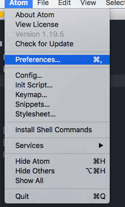
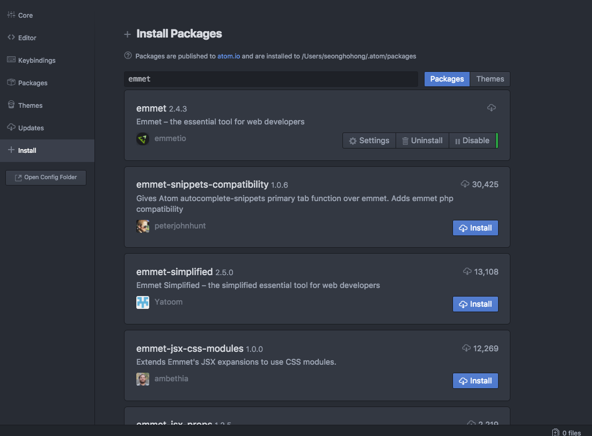
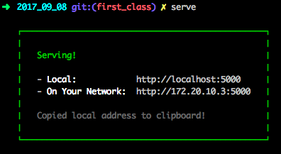
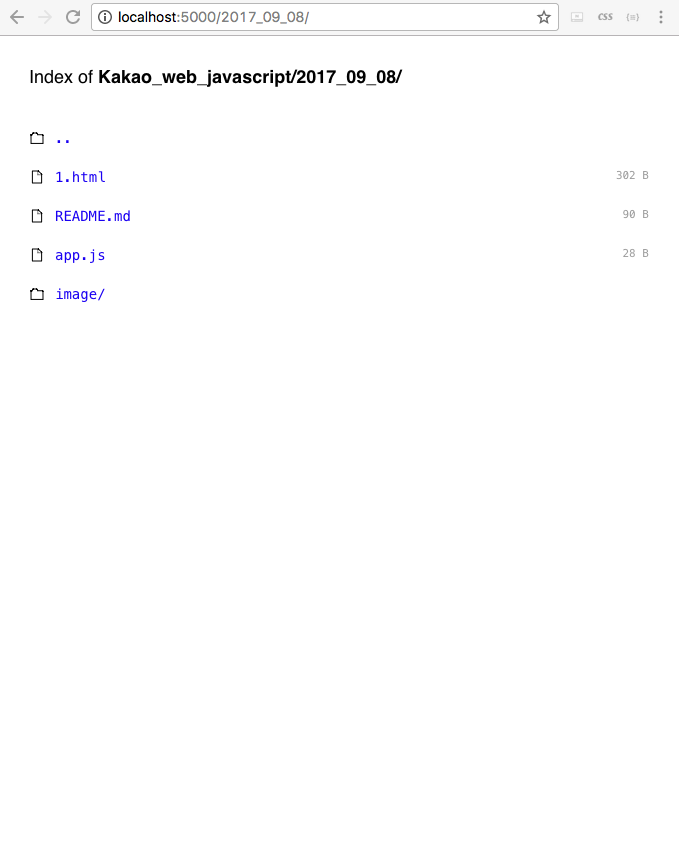
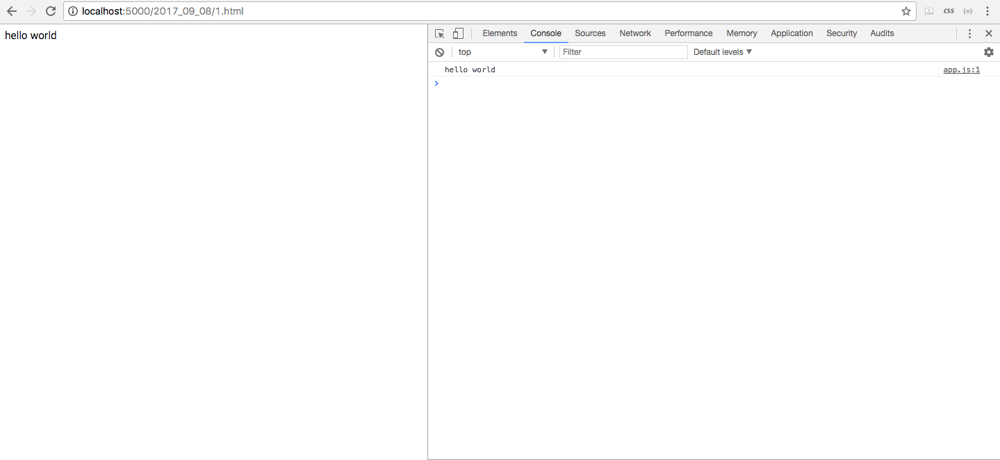
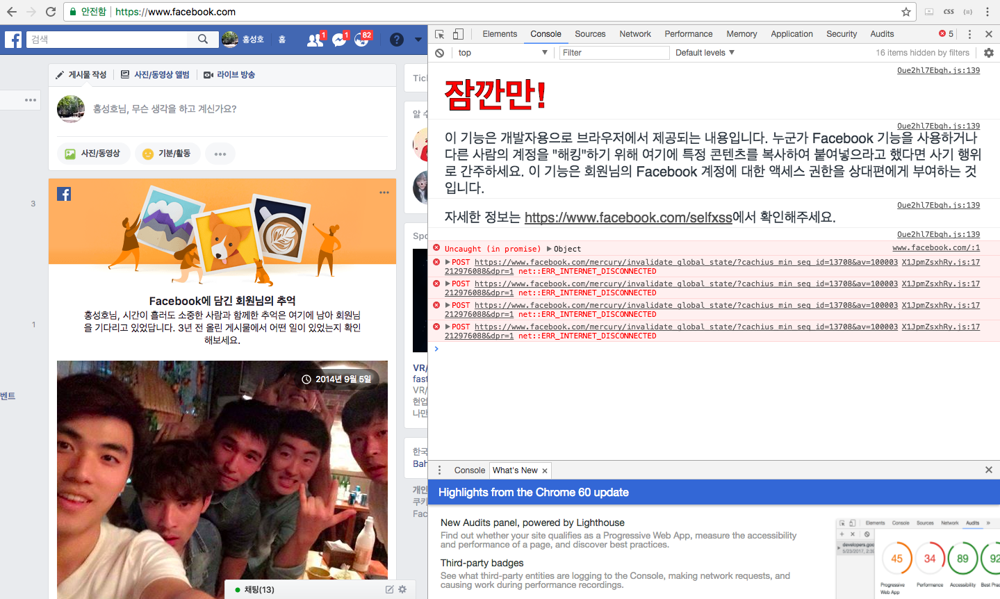

# week01

_________________________
### atom 설치 및 package 관리



- Preferences를 클릭시에 pakage 세팅 탭이 나옵니다.



- pakage 세팅에서 emmet를 검색한후 install을 클릭하면 해당 디렉토리에 DI가 설정됩니다.


**emmet**


html 작업시 수월하게 하는 라이브러리 중 하나입니다.


[emmet document](https://docs.emmet.io/)


[emmet 생활코딩](https://opentutorials.org/course/671/3987)

_________________________
### node.js 설치 및 serve 동작


이제 atom을 이용해서 간단한 웹페이지를 띄어보겠습니다.


atom에서 해당 코드를 쓰고 html파일로 생성합니다.


```html
<!DOCTYPE html>
<html lang="en">
<head>
  <meta charset="UTF-8">
  <meta name="viewport" content="width=device-width, initial-scale=1.0">
  <meta http-equiv="X-UA-Compatible" content="ie=edge">
  <title>Document</title>
</head>
<body>
  hello world
</body>
</html>
```

emmet이 있다면 ! + Tab 만 누르면 자동 생성 됩니다! 참 쉽쥬?
그리고 해당 파일을 열면 html파일을 인터넷 브라우저에서 볼수 있지만 오늘 할 일은 해당 페이지를 자신의 로컬서버에 올리는 것 입니다!


그러기 위해서 javascript로 짜여진 node.js를 사용해보겠습니다.
먼저 자신의 컴퓨터에 node.js serve를 설치하겠습니다.


커멘드 창에 ```npm install serve -g``` 입력하면 node로 서버가 설치되는것을 볼수 있습니다. 그리고 ```serve```를 입력시에 아래 화면처럼 5000번 포트로 서버가 시작되는 것을 볼수 있습니다.(html 파일이 있는 디렉토리에서 시작해 주셔야 합니다.)





그러면 해당 디렉토리에 있는 파일을 페이지에서 확인할수 있습니다.



------------------------------------------------
### chrome 브라우저 console log 찍어보기


이제 준비가 다 되셨으면 이번 시간의 하이라이트인 브라우저 콘솔 로그에 javascript를 이용하여 log를 찍어보겠습니다!


우선 해당 디렉토리에 app.js라는 javascript파일을 하나 생성하겠습니다.

```javascript
console.log('hello world');
```

간단하게 한줄로 브라우저 콘솔에 "hello world"를 찍어보겠습니다.

아 한가지 더 할게 남았습니다. 우선 app.js라는 javascript파일을 실행하기 위해서 html파일에 한줄을 더 넣어주셔야 합니다.

```html
<script src="app.js"></script>
```
이 한줄을 추가하여

```html
<!DOCTYPE html>
<html lang="en">
<head>
  <meta charset="UTF-8">
  <meta name="viewport" content="width=device-width, initial-scale=1.0">
  <meta http-equiv="X-UA-Compatible" content="ie=edge">
  <title>Document</title>
</head>
<body>
  hello world
  <script src="app.js"></script>

</body>
</html>
```

이렇게 만들어 주세요.


준비가 다 되셨으면 아까 들어갔던 웹페이지로 들어가 ```hello world```가 적힌 웹페이지로 가보겠습니다.


그리고 개발자 옵션에 들어가면 console창이 보일꺼에요.
console창에 ```hello world``` 가 따로 찍히신거 보이시쥬?





이렇게 웹 브라우저 안에서 console을 실행 시킬수 있고 javascript를 이용하여 여러 작엄을 할수 있습니다.


facebook같은 경우에는 이를 악용을 막기위해 아래 그림처럼 경고문도 띄어 둔다고 하네요!



