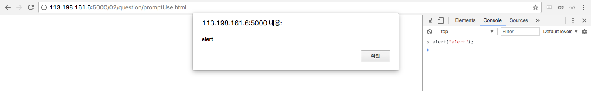
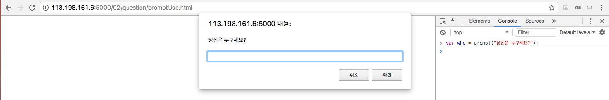
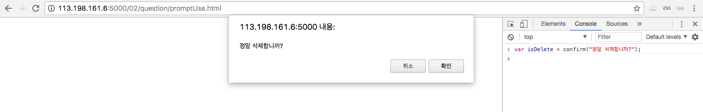

# week02

_________________________
## javascript 기본
[javascript 기본](http://begin.js.org/javascript/index.html)


### 새로 배운점

- 서버에서 보여줄때 **index.html** 로 파일이름을 붙이면 서버의 기본 Root페이지로 나타난다.
- javascript은 변수의 형변환이 아주 자유롭다.
- 문장이 끝날경우 ;(세미클론이)이 들어가도, 안들어가도 되지만 보통 ;(세미클론)을 붙이는 습관을 들이자~!
- typeScript: 타입이 있는 자바스크립트로 변수에 타입을 넣어서 작업할수 있다.
- '==' = '===', '!=' = '!==' 이렇게 동등비교를 할수 있지만 후자를 추천한다.
- 같은 형태의 변수가 아니라도 비교 연산을 사용할수 있다.
```javascript
""           ==   "0"           // false
0            ==   ""            // true
0            ==   "0"           // true
false        ==   "false"       // false
false        ==   "0"           // true
false        ==   undefined     // false
false        ==   null          // false
null         ==   undefined     // true
" \t\r\n"    ==   0             // true
```
- `delete`: 객체 프로퍼티 삭제 -> Ajax로 데이터를 받아 올때 계속해서 싸이는 데이터를 정리할때 사용
- 함수: 코드 덩이리(?), 메소드: 함수 + 객체
_________________________

### 주요 전역 함수

- alert: 웹페이지 내에서 팜업창을 나타냅니다.
```javascript
alert("alert");
```



- prompt: 웹페이지에서 사용자의 input 값을 받아올때 씁니다.
```javascript
var who = prompt("당신은 누구세요?");
```



- confirm: 웹페이지 확인 메세지를 띄울때 많이 씁니다.
```javascript
var isDelete = confirm("정말 삭제합니까?");
```

