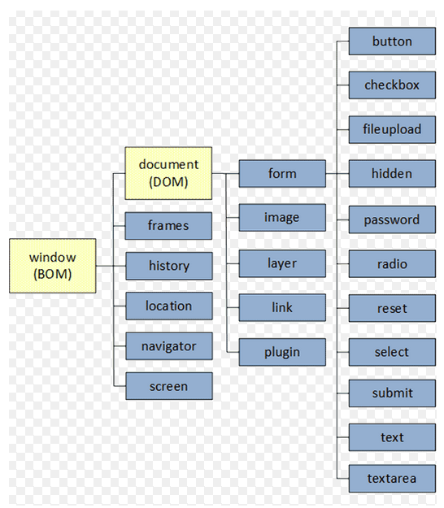

# week03
**web의 동적효과를 위한 이해**
_________________________


## javascript Object Model

### DOM - Document Object Model

- HTML과 XML 문서에 대한 프로그래밍 인터페이스
- 문서를 구성하는 객체에 어떻게 접근할 것인가를 정의하는 API

-> 이 발을 들으면 어떤 느낌인지 와닿지 않을수 있지만 제가 이해한 바로는 HTML의 구성요소를 javascript에서 어떻게 접근해서 다룰지에 대한 방법인거 같습니다.

### BOM - Browser Object Model

BOM 같은 경우에는 DOM 상위 계층으로 브라우저에서 컨트롤 하는 부분을 볼수 있습니다.


간단하게 보기 위해서 아래 표를 참고하시변 이해를 하실수 있을꺼 같습니다.



기본적으로 BOM같은 경우에서는 클라이언트 정보를 관리한다고 볼수 있습니다.

- 클라이언트 측 계층 구조와 레벨 0 DOM
- 브라우저마다 차이


기본적인 BOM 메소드를 찾아 본다면

##### Window
가장 최상위 객체

```javascript
window.outerWidth  //브라우저 크기 접근

window.name  //브라우저 이름(위에 표시되는)

window.open('http://www.daum.net'); //다른 도메인 접속

window.opener  //해당 브라우저 오픈

window.close();  //브라우저 닫기
```

-> 해당 메소드를 보면 **window** 에선 클라이언트의 큰 정보들을 관리한다는걸 알수 있습니다.

#### location
url에 대한 정보

```javascript
location.href='http://www.daum.net';  //새로운 페이지로 이동된다.

location.reload();  //해당 페이지의 정보를 리로딩 한다.
```

#### history
브라우저 정보

```javascript
history.back();  //전에 히스토리로 돌아간다.

history.go(1);
```

#### screen
화면에 대한 정보

```javascript
screen.width;  //화면 넓이

screen.availWidth;  //사용 가능 화면 넓이
```

#### navigator
브라우저 정보

```javascript
navigator.userAgent  //유저 정보

navigator.language  //유저가 사용하는 언어(무슨 언어인지에 따라 서비스 언어를 변겅할수 있다.)

navigator.platform  //무슨 브라우저에서 접근하는지에 대한 정보가 있다.
```

### DOM 메소드
