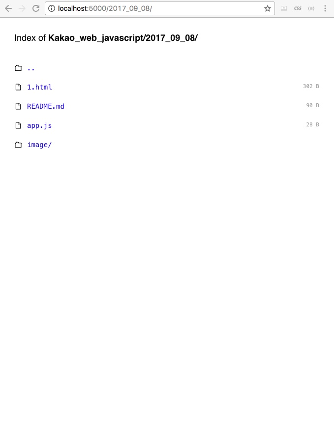

# first class

_________________________
#### atom 설치 및 package 관리


- Preferences를 클릭시에 pakage 세팅 탭이 나옵니다.


- pakage 세팅에서 emmet를 검색한후 install을 클릭하면 해당 디렉토리에 DI가 설정됩니다.


**emmet**
html 작업시 수월하게 하는 라이브러리 중 하나입니다.
[emmet document](https://docs.emmet.io/)
[emmet 생활코딩](https://opentutorials.org/course/671/3987)

_________________________
#### node.js 설치 및 serve 동작

이제 atom을 이용해서 간단한 웹페이지를 띄어보겠습니다.


atom에서 해당 코드를 쓰고 html파일로 생성합니다.

```html
<!DOCTYPE html>
<html lang="en">
<head>
  <meta charset="UTF-8">
  <meta name="viewport" content="width=device-width, initial-scale=1.0">
  <meta http-equiv="X-UA-Compatible" content="ie=edge">
  <title>Document</title>
</head>
<body>
  hello world

  <script src="app.js"></script>

</body>
</html>
```

emmet이 있다면 ! + Tab 만 누르면 자동 생성 됩니다! 참 쉽쥬?
그리고 해당 파일을 열면 html파일을 인터넷 브라우저에서 볼수 있지만 오늘 할 일은 해당 페이지를 자신의 로컬서버에 올리는 것 입니다!


그러기 위해서 javascript로 짜여진 node.js를 사용해보겠습니다.
먼저 자신의 컴퓨터에 node.js serve를 설치하겠습니다.


커멘드 창에 ```shell npm install serve -g``` 입력하면 node로 서버가 설치되는것을 볼수 있습니다. 그리고 ```shell serve```를 입력시에 아래 화면처럼 5000번 포트로 서버가 시작되는 것을 볼수 있습니다.(html 파일이 있는 디렉토리에서 시작해 주셔야 합니다.)


그러면 해당 디렉토리에 있는 파일을 페이지에서 확인할수 있습니다.


------------------------------------------------
